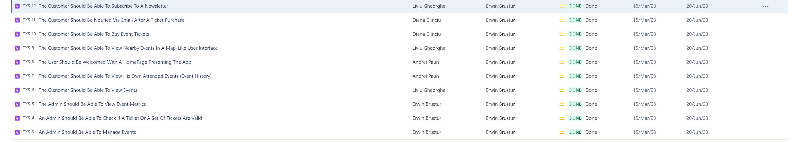
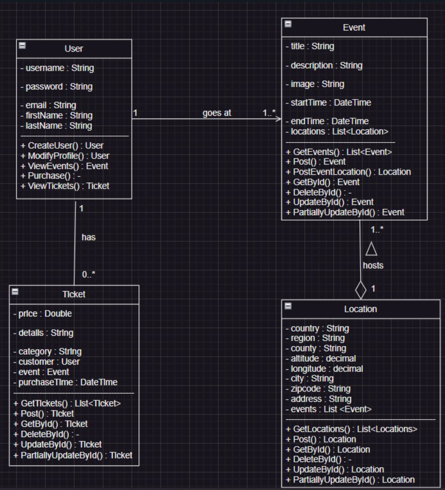

# Proiect MDS

Descriere Proiect: Platforma pentru vanzarea on-line a biletelor la evenimente. Principalele functionalitati ale interfetei grafice sunt: 
- posibilitatea de a crea un cont
- logare
- vizualizarea evenimentelor (individual / lista / cautare evenimente folosind searchbar-ul)
- vizualizarea tichetelor utilizatorului logat 
- vizualizarea locatiilor evenimentelor. 
- pe homepage sunt prezente un header, un footer, un carusel cu imagini si alte cateva sectiuni cu text informativ. 

Restul functionalitatilor (precum adaugarea evenimentelor, cumpararea tichetelor de catre utilizatori etc.) sunt valabile doar via API. 

Videoclip Scurt (~3 min) in care sunt prezentate functionalitatile aplicatiei: https://www.loom.com/share/92c6b0432e6b4aeaa9bc017516a09e7c?sid=14735eab-909d-45ea-beba-c64c10547f84

Puncte atinse:

1. User Stories & Backlog

Story-urile si backlog-ul au fost create in [Jira](https://clinciudiana02.atlassian.net/jira/software/projects/TXS/boards/1).
In cazul in care proiectul nu poate fi vizualizat, atasat mai jos este un ss cu cele 10 story-uri create: 

2. Diagrame

Diagrama UML este atasata mai jos:

3. Source Control cu Git 

- Repo Frontend: https://github.com/liviu-gheorghe/txs-hub-webapp
- Repo Backend: https://github.com/liviu-gheorghe/txs-hub-api

5. Raportare bug si rezolvare cu pull request

Un astfel de bug, legat de responsiveness-ul imaginilor a fost rezolvat aici: https://github.com/liviu-gheorghe/txs-hub-api/issues/1

7. Comentarii cod

Un exemplu de fisier in care au fost adaugate comentarii este serviciul de evenimente din backend: https://github.com/liviu-gheorghe/txs-hub-api/blob/main/txs-hub-api/Services/Events/EventsService.cs

8. Design Patterns

S-au utilizat design patterns precum Repository Pattern, Interface Pattern si Dependency Injection

9. Folosirea unui tool de AI care ajuta in timpul dezvoltarii software

S-a utilizat ChatGPT pentru a genera continutul de pe homepage. De asemenea, s-a utilizat Github Copilot pentru code autocompletion. 